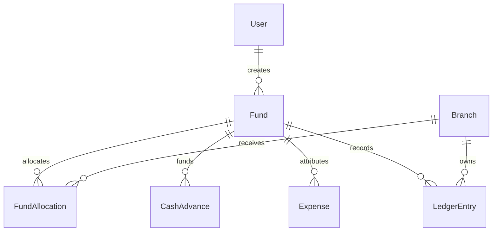

# Phase 8 — Fund management

Phase 8 adds optional donor/grant attribution without changing the existing approval chain. Existing cash advances and expenses remain valid because both new foreign keys are nullable.

## Schema

`Fund.status` is `ACTIVE` or `CLOSED`. `FundAllocation` is unique per fund and branch; allocating the same pair again replaces its amount and posts only the delta as a `FUND_DEPOSIT`. Fund spending is derived as disbursed/settled advances plus approved direct expenses. Expenses belonging to a funded advance are not counted twice.

## API

- `POST /api/funds` — Finance Head creates a fund.
- `GET /api/funds?status=&donor=&from=&to=&branchId=` — role-scoped list.
- `GET /api/funds/:id` — totals, allocations, advances, and expenses.
- `PATCH /api/funds/:id` — Finance Head edits or closes a fund.
- `POST /api/funds/:id/allocate` — Finance Head sets a branch allocation and posts a ledger deposit.
- `GET /api/reports/fund-utilization.csv?fundId=` — donor-ready CSV.
- `GET /api/reports/fund-utilization.pdf?fundId=` — donor-ready PDF.

Cash advance `POST` accepts optional `fundId` and returns `{ cashAdvance, warning }`. Expense `POST` accepts optional `fundId`; if omitted, it inherits the linked advance's fund. A direct expense can specify it explicitly.

## Test

1. Apply migrations with `cd backend && npx prisma migrate deploy`, then generate the client.
2. Log in as Finance Head, open `/finance-head/funds`, create an active USD fund, and allocate part of it to a branch.
3. Confirm the branch ledger contains `FUND_DEPOSIT` and its running balance increased by the allocation.
4. Log in as a Branch Manager or Program Officer, request an advance and select the allocated fund. An over-allocation shows a warning; final disbursement is blocked if funds are insufficient.
5. Complete the unchanged Accounts Head → Finance Head approval flow and disburse. Confirm fund spent/remaining and ledger balance changed.
6. At 90% utilization, confirm Finance Heads receive one `FUND_THRESHOLD` notification.
7. Create an expense linked to the advance and verify its fund is inherited. Confirm it appears in fund detail but does not double-count spending.
8. Download CSV and PDF utilization reports and verify totals/category breakdown.
9. Close the fund and confirm new allocations/disbursements are rejected. Verify `FUND_CREATED`, `FUND_ALLOCATED`, and `FUND_CLOSED` audit events.

## Sample lifecycle

Create “Health Outreach 2026” from “Example Foundation” for USD 100,000 → allocate USD 30,000 to Lahore → request and approve a USD 10,000 funded advance → disburse it → record categorized expenses against that advance → export the utilization report → close the fund after reconciliation. Unlinked advances continue through the original workflow.
